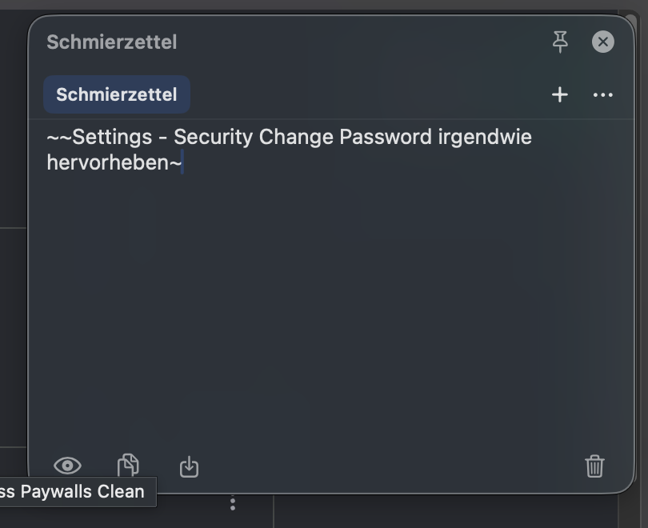

<p align="center">
  <strong>Floty</strong><br>
  <em>your floating notes</em>
</p>

A small, unobtrusive floating scratchpad for macOS. Not a note-taking app — a
digital scrap of paper that is always one keystroke away.

> **Status:** early development. Nothing to install yet.



## What it does

- **Floating panel** — move it, resize it, make it as translucent as you like.
  Pin it to keep it above everything, or let it disappear the moment you click
  away.
- **Lives in the menu bar** — a global hotkey toggles it. No Dock icon, no
  Cmd-Tab entry.
- **Markdown with live styling** — bold, italic, strikethrough and task lists
  render as you type, while the markers stay in the text. What you see is
  exactly what the file contains.
- **Task lists** — `- [ ]` is drawn as a clickable checkbox, and checking it
  strikes the line through. Stored as standard Markdown, so Obsidian and GitHub
  treat them as real tasks.
- **Tabs** — one note per tab, one `.md` file per note.
- **Plain files, real folders** — notes live in a folder you choose. Put it in
  iCloud Drive and macOS syncs it across your Macs. Floty never touches the
  network.
- **Hand off to Obsidian** — capture in Floty, file it in Obsidian.

## Requirements

macOS 26 or newer.

## Building

```bash
brew install xcodegen
xcodegen generate
open Floty.xcodeproj
```

## Installing

Until signed releases exist, build and install locally:

```bash
./scripts/install.sh
```

This builds Release and puts `Floty.app` into `/Applications`.

## Documentation

Project documentation is in German: [ANFORDERUNGEN.md](ANFORDERUNGEN.md) (what
it should do), [STAND.md](STAND.md) (what is built and why it was decided that
way), [TODO.md](TODO.md) (what is still open).

## License

Not decided yet.

The app icon is based on a clipboard glyph by
[Zlatko Najdenovski](https://www.figma.com/@zlat), licensed CC Attribution.
Source: [`Resources/AppIcon.svg`](Resources/AppIcon.svg), rendered by
[`scripts/make-icon.swift`](scripts/make-icon.swift).
